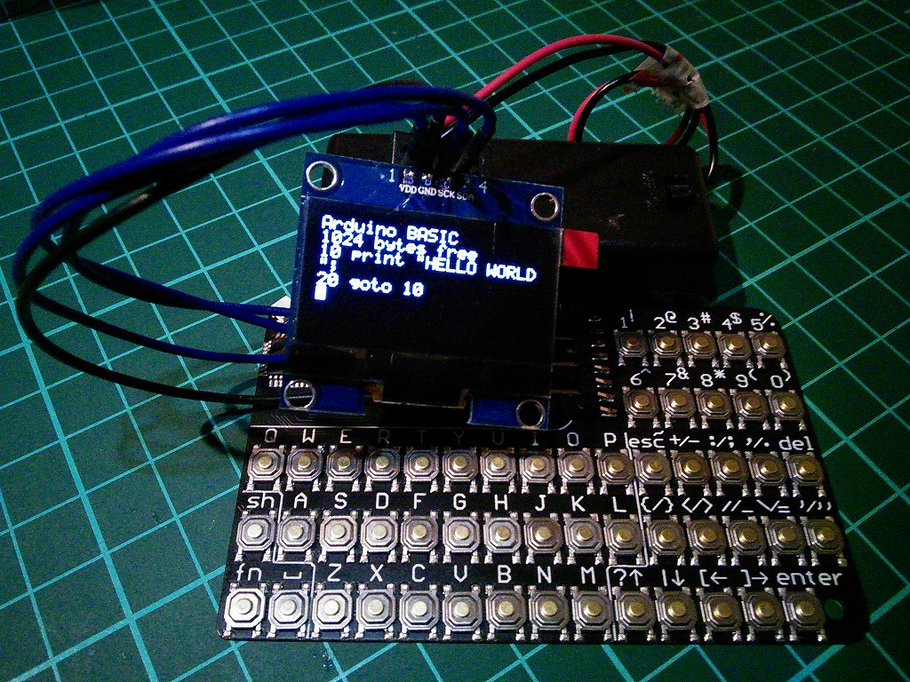

# CardKB HATでArduinoBasicが動作する自作ポケコン
[M5stak](https://m5stack.com/)用のCardCB HATとI2CのOLED(128x32)で、Robin Edwardsさんの[ArduinoBasic](https://github.com/robinhedwards/ArduinoBASIC)が動く自作ポケコンです。80年代の家庭用コンピューターで使われていたBasic言語を実行することができます。I2CのOLED(128x64)をそのまま差し替えると縦に２倍拡大して表示されます。 

## Infomation
- 詳細は[ArduinoBasic_cardKB](https://github.com/KeiTakagi/ArduinoBasic_cardKB)を参照してください。
